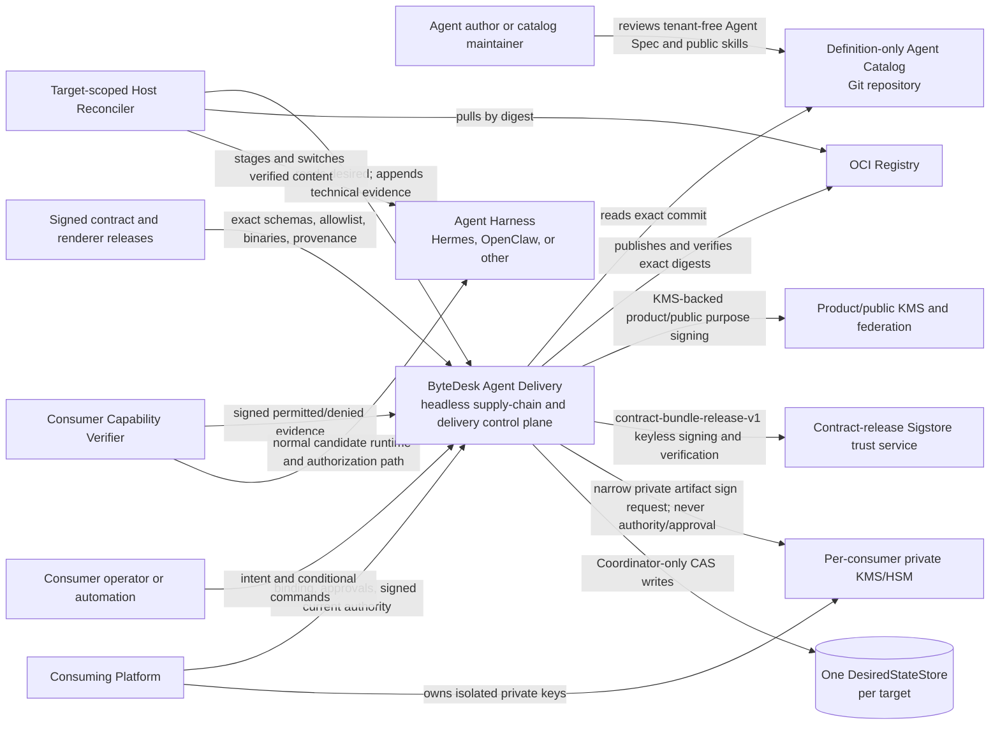
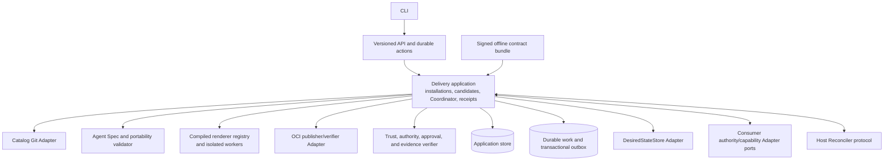
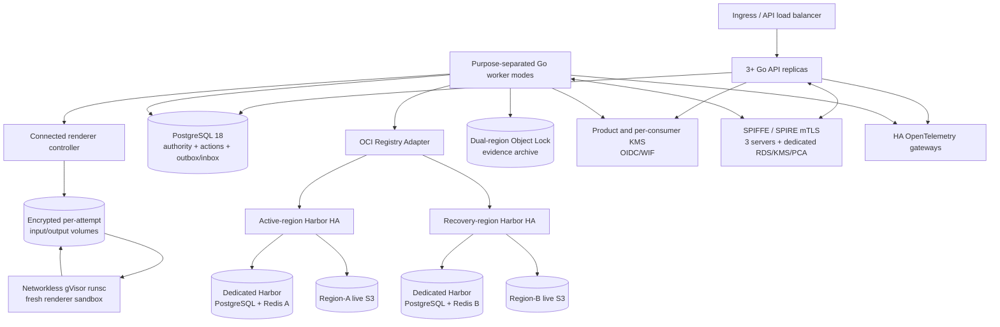
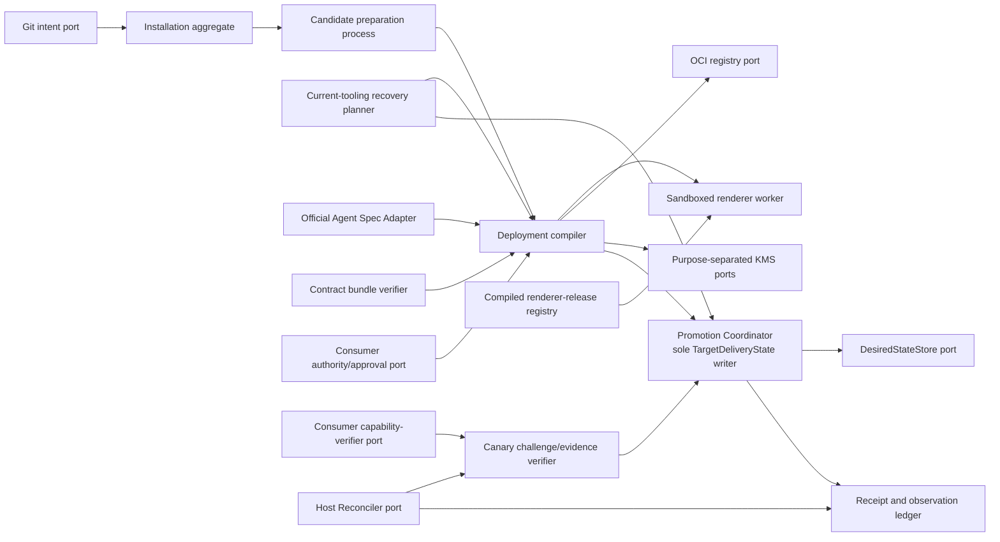

# C4 model

This is the standalone product view. ByteDesk Platform is one external
consumer, not a container inside Agent Delivery.

## C1 — System context

## C2 — Agent Delivery containers

V1 is a modular monolith plus durable state/work execution and sandboxed
renderer workers. Logical container boundaries do not imply microservices.

### C2 reference deployment

The concrete reference profile is defined by
[ADR-0002](adr/0002-implementation-stack-and-reference-topology.md).

API and worker replicas are stateless outside PostgreSQL leases and actions.
The Promotion Coordinator has no process-leader authority: exact target CAS and
worker fencing decide the one accepted transition. Each eligible OCI graph was
pushed and digest-read through both Harbor APIs; direct writes to Harbor's S3
layout are forbidden. Registry blobs live outside application PostgreSQL while
their exact descriptors and evidence roots live inside it. Harbor metadata and
SPIRE registration stores are isolated infrastructure planes, not product or
consumer authority.

## C3 — Core components

Only `Promotion Coordinator --> DesiredStateStore` is an authoritative desired-
state write path. Git, compiler, recovery planner, Host Reconciler, capability
verifier, observations, and receipts cannot bypass it.

## Dynamic view — end-to-end delivery flows

```mermaid
flowchart LR
  Authoring[Author tenant-free Agent Spec and optional public skills]
  Publication[Validate, render, evaluate, sign, and publish exact public artifacts]
  Import[Import exact source and renderer identities]
  PrivateCustomization[Apply consumer-owned functional, file, and skill operations]
  Compilation[Revalidate, fully rerender, compile, and privately sign]
  Coordinator[Promotion Coordinator verifies current gates]
  DesiredState[(One target DesiredStateStore)]
  Reconciliation[Target-scoped Host Reconciler stages exact release]
  Canary[Separate host and consumer capability evidence]
  Activation[Coordinator authorizes switch and records receipt]
  EligibleHistory[Eligible historical functional content only]
  ForwardRecovery[Build a new revision with current tooling and authority]

  Authoring --> Publication
  Publication --> Import
  Import --> PrivateCustomization
  PrivateCustomization --> Compilation
  Compilation --> Coordinator
  Coordinator -->|sole logical CAS writer| DesiredState
  DesiredState --> Reconciliation
  Reconciliation --> Canary
  Canary --> Coordinator
  Coordinator --> Activation
  EligibleHistory --> ForwardRecovery
  ForwardRecovery --> Compilation
```

The recovery edge rejoins compilation before desired state. It cannot activate
historical deployment state, signatures, authority, or credentials. The
Host Reconciler and capability verifier return evidence to the Coordinator;
neither writes desired state or promotes itself.

## Relationships deliberately absent

- Catalog or binding content cannot supply schemas, trust roots, renderer code,
  renderer redirects, consumer identity, grants, or desired state.
- Public endpoints never accept consumer customizations, private skills, or
  private authority evidence.
- Agent Delivery never executes skill files or artifact hooks. A runtime may
  expose exact-digest-approved content only after activation under current
  consumer sandbox, network, identity, and call-time authorization.
- Product/public signers cannot satisfy consumer-private signing purposes; a
  provider-wide key cannot sign multiple consumers' private artifacts.
- The KMS-only product-release signer cannot sign contract bundles, and the
  keyless contract-bundle signer cannot satisfy product-release policy.
- Agent Delivery does not issue human or workload identity, grants, business
  approval, or call-time authorization.
- Host Reconcilers do not receive desired-write, human administration, or agent
  capability permissions and cannot run consumer capability probes.
- Capability verifiers and evidence cannot promote themselves.
- No target has two authoritative desired-state stores or live dual write.
- Harnesses do not pull mutable catalog content or execute revoked renderer
  tooling.
- Recovery never reactivates an old deployment, receipt, authority snapshot,
  signature, credential state, render bundle, or revoked renderer.
