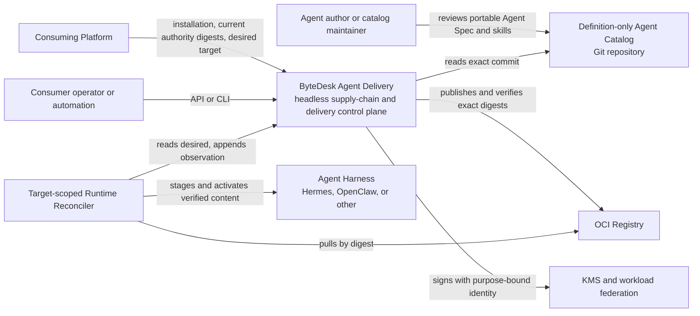
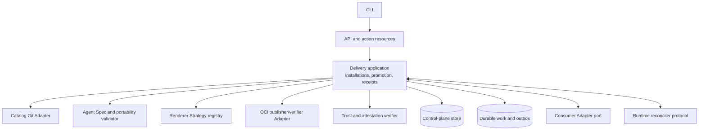
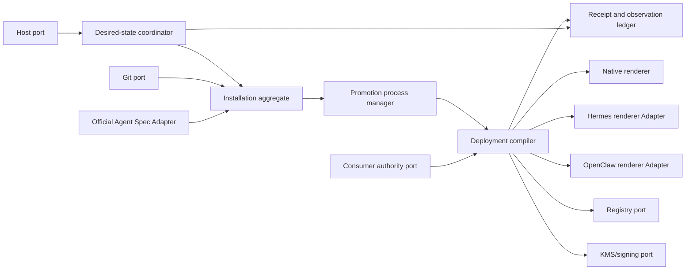

# C4 model

This is the standalone product view. ByteDesk Platform is one external
consumer, not a container inside Agent Delivery.

## C1 — System context

## C2 — Agent Delivery containers

V1 is deployed as a modular monolith plus durable store/work execution. The
logical container boundaries do not imply independent microservices.

## C3 — Core components

## Relationships deliberately absent

- Catalog packages do not call MCP servers or secret stores.
- Agent Delivery does not issue human or agent workload tokens.
- Agent Delivery does not own conversations, goals, tasks, or execution queues.
- A host reconciler does not receive human administration or agent capability
  permissions.
- Harnesses do not pull mutable catalog Git content.
