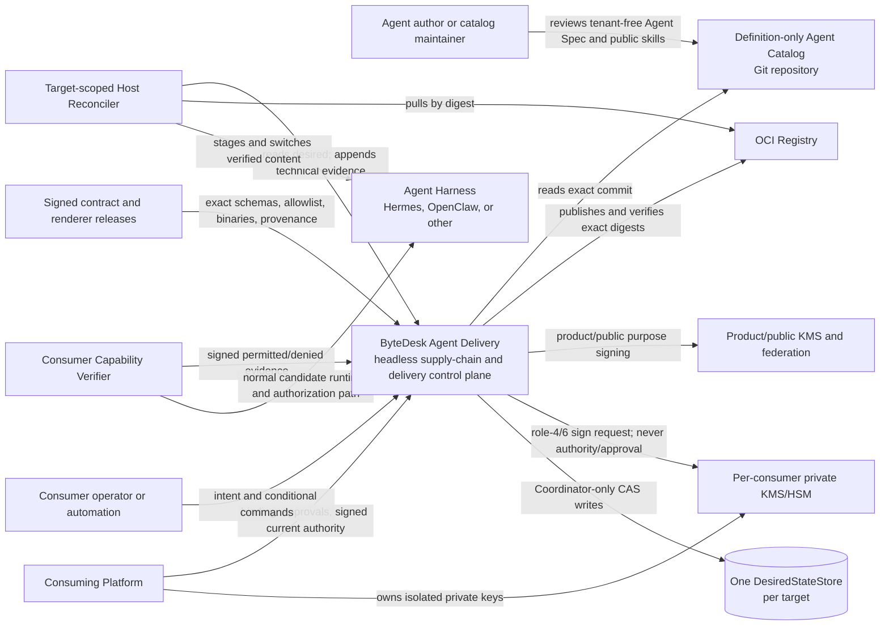
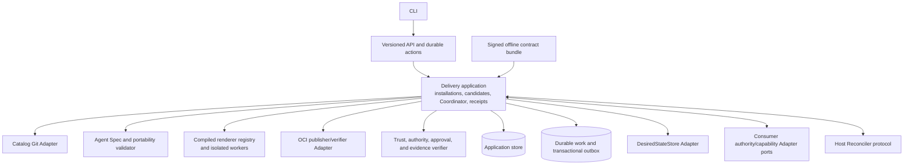
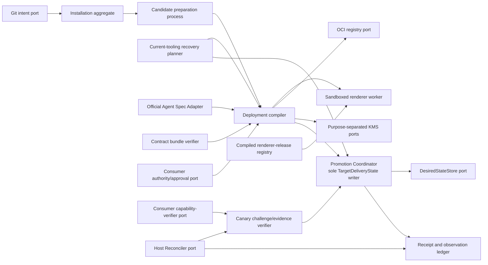

# C4 model

This is the standalone product view. ByteDesk Platform is one external
consumer, not a container inside Agent Delivery.

## C1 — System context

## C2 — Agent Delivery containers

V1 is a modular monolith plus durable state/work execution and sandboxed
renderer workers. Logical container boundaries do not imply microservices.

## C3 — Core components

Only `Promotion Coordinator --> DesiredStateStore` is an authoritative desired-
state write path. Git, compiler, recovery planner, Host Reconciler, capability
verifier, observations, and receipts cannot bypass it.

## Relationships deliberately absent

- Catalog or binding content cannot supply schemas, trust roots, renderer code,
  renderer redirects, consumer identity, grants, or desired state.
- Public endpoints never accept consumer customizations, private skills, or
  private authority evidence.
- Agent Delivery never executes skill files or artifact hooks. A runtime may
  expose exact-digest-approved content only after activation under current
  consumer sandbox, network, identity, and call-time authorization.
- Product/public signers cannot satisfy consumer-private signing purposes; a
  provider-wide key cannot sign multiple consumers' private artifacts.
- Agent Delivery does not issue human or workload identity, grants, business
  approval, or call-time authorization.
- Host Reconcilers do not receive desired-write, human administration, or agent
  capability permissions and cannot run consumer capability probes.
- Capability verifiers and evidence cannot promote themselves.
- No target has two authoritative desired-state stores or live dual write.
- Harnesses do not pull mutable catalog content or execute revoked renderer
  tooling.
- Recovery never reactivates an old deployment, receipt, authority snapshot,
  signature, credential state, render bundle, or revoked renderer.
